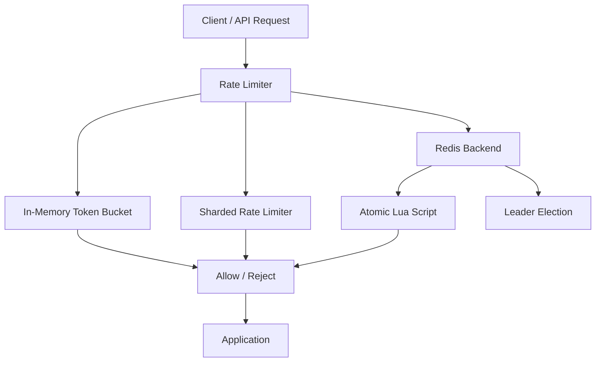
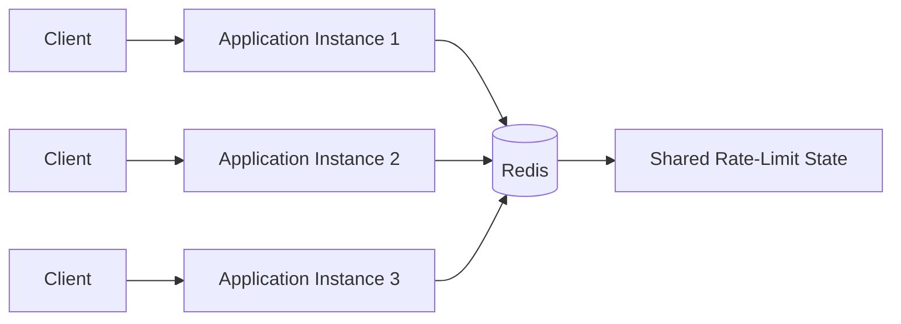
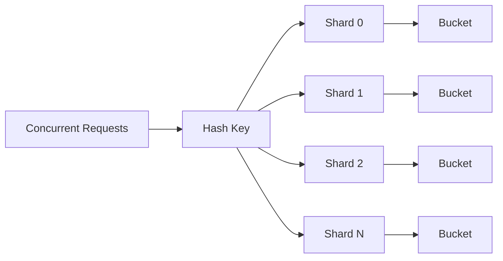
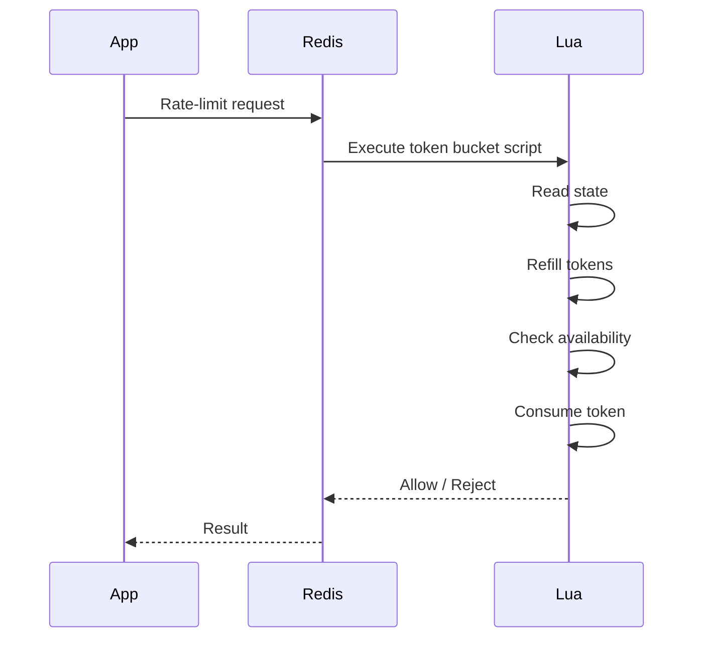
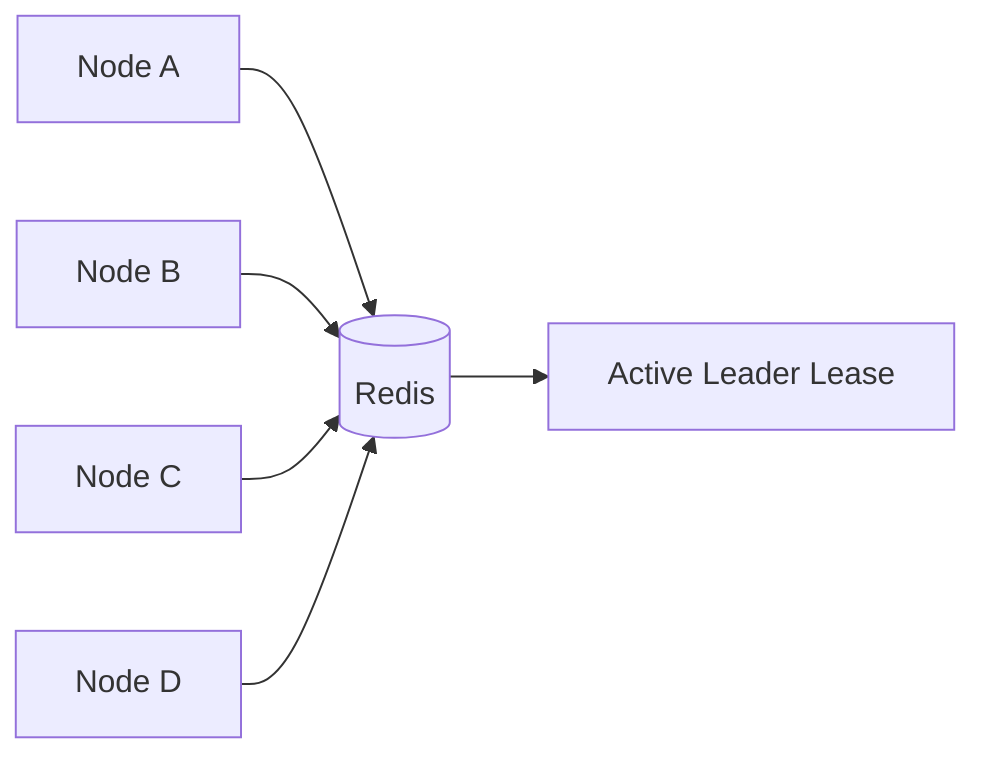

# Distributed Rate Limiter

A high-performance, thread-safe and distributed rate limiter implemented in **C++17** with **Redis**, **Lua scripting**, **CMake**, **GoogleTest**, Docker, and GitHub Actions.

The project implements token-bucket rate limiting in both local and distributed forms, including sharded in-memory limiting, atomic Redis operations, leader election, concurrency validation, and performance benchmarks.

---

## Table of Contents

- [Overview](#overview)
- [Key Features](#key-features)
- [Architecture](#architecture)
- [Token Bucket](#token-bucket)
- [Sharded Rate Limiter](#sharded-rate-limiter)
- [Project Structure](#project-structure)
- [Technology Stack](#technology-stack)
- [Requirements](#requirements)
- [Quick Start](#quick-start)
- [Environment Configuration](#environment-configuration)
- [Building Manually](#building-manually)
- [Running Tests](#running-tests)
- [Concurrency Demo](#concurrency-demo)
- [Benchmarks](#benchmarks)
- [Benchmark Results](#benchmark-results)
- [Benchmark Metrics](#benchmark-metrics)
- [Redis Backend](#redis-backend)
- [Leader Election](#leader-election)
- [Lua Scripts](#lua-scripts)
- [CMake Presets](#cmake-presets)
- [Docker](#docker)
- [CI/CD](#cicd)
- [Performance Considerations](#performance-considerations)
- [Troubleshooting](#troubleshooting)
- [Production Considerations](#production-considerations)
- [Future Improvements](#future-improvements)
- [Contributing](#contributing)
- [License](#license)

---

## Overview

Rate limiting controls how frequently a client, user, API key, or service can perform an operation.

Conceptually:

```text
Client
  |
  | Request
  v
+-------------------+
|   Rate Limiter    |
+-------------------+
  |
  +---- Allowed ----> Application
  |
  +---- Rejected ---> HTTP 429
```

This project supports:

1. Thread-safe in-memory rate limiting
2. Sharded in-memory rate limiting
3. Redis-backed distributed rate limiting
4. Concurrent access from multiple threads
5. Redis Lua atomic operations
6. Redis-based leader election
7. Automated unit/integration tests
8. Performance and contention benchmarks

---

## Key Features

### Rate Limiting

- Token bucket algorithm
- Configurable capacity
- Configurable refill rate
- Per-key rate limiting
- Thread-safe implementation
- Redis-backed shared state

### Concurrency

- Multi-threaded request processing
- Thread-safe token bucket
- Sharded rate limiter
- Concurrent Redis access
- Multi-key isolation
- Contention benchmarking

### Distributed Coordination

- Redis shared state
- Leader election
- Lease/TTL handling
- Leader renewal
- Stale-leader protection/fencing behavior

### Testing

- GoogleTest unit tests
- Redis integration tests
- Multi-threaded stress tests
- Smoke tests
- Concurrency demonstration

### Benchmarking

The project measures:

- Requests
- Granted requests
- Denied requests
- Throughput
- Average latency
- P50 latency
- P95 latency
- P99 latency
- Minimum latency
- Maximum latency
- Sharding speedup
- Lock-contention speedup

---

## Architecture



### Distributed Deployment



All application instances can share rate-limit state through Redis.

---

## Token Bucket

The limiter uses a token-bucket model.

For example:

```text
Capacity     = 10 tokens
Refill rate  = 2 tokens/second
```

A request consumes one token when a token is available:

```text
Request
   |
   v
Token available?
   |
   +-- YES --> Consume token --> Allow
   |
   +-- NO ---> Reject
```

Tokens are replenished according to the configured refill rate.

---

## Sharded Rate Limiter

A single shared mutex can become a contention point when many threads access the limiter concurrently.

Sharding distributes keys across multiple independent buckets/locks:



The benefit depends on workload, key distribution, hardware, and contention characteristics.

---

## Project Structure

```text
distributed-rate-limiter/
|
+-- .github/
|   +-- workflows/
|       +-- ci.yml
|       +-- benchmark.yml
|
+-- include/
|   +-- ...
|
+-- src/
|   +-- ...
|
+-- tests/
|   +-- test_*.cpp
|   +-- manual_*.cpp
|   +-- *_smoke_test.cpp
|   +-- CMakeLists.txt
|
+-- benchmarks/
|   +-- benchmark.cpp
|   +-- benchmark_redis.cpp
|   +-- benchmark_contention.cpp
|   +-- CMakeLists.txt
|
+-- scripts/
|   +-- token_bucket.lua
|   +-- leader_renew.lua
|   +-- setup_windows.ps1
|   +-- setup_linux.sh
|   +-- setup_macos.sh
|   +-- run_demo.ps1
|   +-- run_demo.sh
|
+-- docs/
|   +-- benchmark-methodology.md
|
+-- .env.example
+-- .gitignore
+-- CMakeLists.txt
+-- CMakePresets.json
+-- docker-compose.yml
+-- CONTRIBUTING.md
+-- LICENSE
+-- README.md
```

---

## Technology Stack

| Component | Technology |
|---|---|
| Language | C++17 |
| Build System | CMake |
| Windows Compiler | MSVC |
| Linux/macOS Compiler | GCC / Clang |
| Distributed Store | Redis |
| Redis Client | redis-plus-plus |
| Redis Client Dependency | hiredis |
| Atomic Operations | Redis Lua |
| Testing | GoogleTest |
| Containers | Docker |
| CI/CD | GitHub Actions |
| Dependency Management | vcpkg |

---

## Requirements

### Windows

- Windows 10/11
- Visual Studio Build Tools 2026
- CMake 4.x
- Git
- Docker Desktop
- vcpkg

The project uses the Visual Studio 2026 CMake generator:

```text
Visual Studio 18 2026
```

### Linux

- GCC or Clang
- CMake
- Git
- Docker
- vcpkg

### macOS

- Apple Clang
- CMake
- Git
- Docker
- vcpkg

---

## Quick Start

### 1. Clone

```bash
git clone <YOUR_REPOSITORY_URL>
cd distributed-rate-limiter
```

### 2. Start Redis

```bash
docker compose up -d redis
```

Verify:

```bash
docker exec distributed-rate-limiter-redis redis-cli ping
```

Expected:

```text
PONG
```

### 3. Configure and Build

#### Windows

```powershell
powershell -ExecutionPolicy Bypass -File .\scripts\setup_windows.ps1
cmake --preset windows-release
cmake --build --preset windows-release
```

#### Linux

```bash
chmod +x scripts/setup_linux.sh
./scripts/setup_linux.sh

cmake --preset linux-release
cmake --build --preset linux-release
```

#### macOS

```bash
chmod +x scripts/setup_macos.sh
./scripts/setup_macos.sh

cmake --preset macos-release
cmake --build --preset macos-release
```

### 4. Run Tests

```bash
ctest --preset windows-release
```

Use the corresponding preset on Linux/macOS.

### 5. Run the Demo

Windows:

```powershell
.\build\Release\concurrency_demo.exe
```

Linux/macOS:

```bash
./build/concurrency_demo
```

---

## Environment Configuration

Copy the example environment file:

```text
.env.example -> .env
```

Example:

```env
REDIS_URL=tcp://127.0.0.1:6379

RATE_LIMIT_CAPACITY=10
RATE_LIMIT_REFILL_RATE=2

LEADER_TTL_SECONDS=10

SERVER_INTERVAL_MS=500
NODE_ID=node_A

DEMO_THREADS=32
DEMO_ATTEMPTS=50
DEMO_CAPACITY=100
DEMO_KEYS=16
```

### Configuration Reference

| Variable | Description | Example |
|---|---|---:|
| `REDIS_URL` | Redis connection URL | `tcp://127.0.0.1:6379` |
| `RATE_LIMIT_CAPACITY` | Maximum bucket capacity | `10` |
| `RATE_LIMIT_REFILL_RATE` | Token refill rate | `2` |
| `LEADER_TTL_SECONDS` | Leader lease duration | `10` |
| `SERVER_INTERVAL_MS` | Server/demo interval | `500` |
| `NODE_ID` | Node identifier | `node_A` |
| `DEMO_THREADS` | Demo thread count | `32` |
| `DEMO_ATTEMPTS` | Attempts per thread | `50` |
| `DEMO_CAPACITY` | Demo capacity | `100` |
| `DEMO_KEYS` | Demo key count | `16` |

`.env` is intended for local configuration and should not be committed.

---

## Automatic Lua Script Path

The Lua scripts live in:

```text
scripts/token_bucket.lua
scripts/leader_renew.lua
```

CTest is configured to use the repository's script directory automatically.

Therefore a developer cloning the repository does not need to hard-code a machine-specific path such as:

```text
D:\distributed-rate-limiter\scripts
```

This keeps the repository portable across different clone locations and machines.

---

## Building Manually

Windows:

```powershell
cmake -S . -B build `
  -G "Visual Studio 18 2026" `
  -A x64 `
  -DCMAKE_TOOLCHAIN_FILE=C:\vcpkg\scripts\buildsystems\vcpkg.cmake
```

Build:

```powershell
cmake --build build --config Release --parallel
```

Test:

```powershell
ctest --test-dir build -C Release --output-on-failure
```

---

## Clean Build

If CMake reports a generator/toolset mismatch:

```powershell
Remove-Item -Recurse -Force .\build
```

Then:

```powershell
cmake --preset windows-release
cmake --build --preset windows-release
```

Do not reuse a build directory configured with a different generator, architecture, compiler, or toolset.

---

## Running Tests

Run all CTest tests:

```powershell
ctest --test-dir build -C Release --output-on-failure
```

The test suite covers:

### Token Bucket

- Initial capacity
- Token consumption
- Refill
- Rejection when empty
- Timing behavior

### Sharded Limiter

- Per-key isolation
- Concurrent requests
- Shard behavior
- Capacity enforcement

### Redis Backend

- Redis connectivity
- Atomic token consumption
- Concurrent access
- Multi-key isolation
- Lua execution

### Leader Election

- Leader acquisition
- Lease expiration
- Renewal
- Competing leaders
- Stale-leader protection

---

## Concurrency Demo

Run:

```powershell
.\build\Release\concurrency_demo.exe
```

The demo validates five scenarios:

1. Thread-safe token bucket
2. Sharded rate limiter
3. Redis cross-thread atomicity
4. Redis multi-key isolation
5. Leader election and TTL behavior

The demo is intended as a quick correctness/concurrency validation before running benchmarks.

---

# Benchmarks

The project contains three benchmark executables:

```text
bench.exe
bench_redis.exe
bench_contention.exe
```

All benchmark results are workload-dependent.

For meaningful comparisons, use the same:

- machine
- build mode
- compiler
- workload
- Redis configuration
- background-load conditions

---

## 1. In-Memory Benchmark

Command:

```powershell
.\build\Release\bench.exe 16 10000 1000
```

Arguments:

```text
bench.exe <threads> <requests-per-thread> <keys>
```

Configuration:

```text
Threads          : 16
Requests/thread  : 10000
Keys              : 1000
Total requests   : 160000
Build             : Release
Platform          : Windows
```

### Single Thread-Safe Bucket

```text
requests       : 160000
granted        : 160000
denied         : 0
elapsed        : 30.557 ms
throughput     : 5236133.25 req/s
latency avg    : 2.45 us
latency p50    : 0.20 us
latency p95    : 4.60 us
latency p99    : 28.90 us
latency min    : 0.00 us
latency max    : 7017.20 us
```

### Sharded Limiter — 4 Shards

```text
requests       : 160000
granted        : 160000
denied         : 0
elapsed        : 12.014 ms
throughput     : 13317463.36 req/s
latency avg    : 0.91 us
latency p50    : 0.30 us
latency p95    : 2.10 us
latency p99    : 6.40 us
latency min    : 0.10 us
latency max    : 1777.70 us
speedup        : 2.54x
```

### Sharded Limiter — 16 Shards

```text
requests       : 160000
granted        : 160000
denied         : 0
elapsed        : 10.516 ms
throughput     : 15214476.57 req/s
latency avg    : 0.74 us
latency p50    : 0.30 us
latency p95    : 0.90 us
latency p99    : 2.20 us
latency min    : 0.10 us
latency max    : 1193.00 us
speedup        : 2.91x
```

### Sharded Limiter — 64 Shards

```text
requests       : 160000
granted        : 160000
denied         : 0
elapsed        : 8.166 ms
throughput     : 19592956.33 req/s
latency avg    : 0.56 us
latency p50    : 0.30 us
latency p95    : 0.50 us
latency p99    : 1.30 us
latency min    : 0.10 us
latency max    : 1115.10 us
speedup        : 3.74x
```

### In-Memory Summary

| Configuration | Throughput | Avg | P50 | P95 | P99 | Speedup |
|---|---:|---:|---:|---:|---:|---:|
| Single bucket | 5.24M req/s | 2.45 µs | 0.20 µs | 4.60 µs | 28.90 µs | 1.00x |
| 4 shards | 13.32M req/s | 0.91 µs | 0.30 µs | 2.10 µs | 6.40 µs | 2.54x |
| 16 shards | 15.21M req/s | 0.74 µs | 0.30 µs | 0.90 µs | 2.20 µs | 2.91x |
| 64 shards | 19.59M req/s | 0.56 µs | 0.30 µs | 0.50 µs | 1.30 µs | 3.74x |

Under this workload, the measured 64-shard configuration reached approximately **19.59 million requests/sec**, versus approximately **5.24 million requests/sec** for the single-bucket configuration.

The measured speedup was **3.74x**.

These values are reference measurements from one development machine and are not universal performance guarantees.

---

## 2. Redis Benchmark

Start Redis:

```powershell
docker compose up -d redis
```

Run:

```powershell
.\build\Release\bench_redis.exe
```

Measured result:

```text
Redis backend benchmark

requests       : 8000
granted        : 8000
denied         : 0
elapsed        : 3575.408 ms
throughput     : 2237.51 req/s

latency avg    : 3328.92 us
latency p50    : 442.20 us
latency p95    : 21154.48 us
latency p99    : 51217.01 us
latency min    : 331.30 us
latency max    : 180056.00 us

Redis URL: tcp://127.0.0.1:6379
```

### Redis Summary

| Metric | Result |
|---|---:|
| Requests | 8,000 |
| Granted | 8,000 |
| Denied | 0 |
| Throughput | 2,237.51 req/s |
| Average latency | 3,328.92 µs |
| P50 | 442.20 µs |
| P95 | 21,154.48 µs |
| P99 | 51,217.01 µs |
| Minimum | 331.30 µs |
| Maximum | 180,056.00 µs |

Redis-backed rate limiting has substantially different performance characteristics from local in-memory limiting because requests involve external state, Redis command execution, client-side processing, scheduling, and potentially network latency.

---

## 3. Contention Benchmark

Run:

```powershell
.\build\Release\bench_contention.exe 16 200 1000 500
```

Arguments:

```text
bench_contention.exe
    <threads>
    <requests-per-thread>
    <keys>
    <critical-section-us>
```

Configuration:

```text
Threads          : 16
Requests/thread  : 200
Keys             : 1000
Critical section : 500 us
```

Measured result:

```text
single global lock | 1608.58 ms | 1989.34 req/s

1 shards           | 1608.74 ms | 1989.13 req/s | speedup 1.00x

4 shards           | 428.01 ms  | 7476.41 req/s | speedup 3.76x

16 shards          | 148.10 ms  | 21606.29 req/s | speedup 10.86x

64 shards          | 136.77 ms  | 23397.18 req/s | speedup 11.76x
```

### Contention Summary

| Configuration | Elapsed | Throughput | Speedup |
|---|---:|---:|---:|
| Global lock | 1608.58 ms | 1,989.34 req/s | 1.00x |
| 1 shard | 1608.74 ms | 1,989.13 req/s | 1.00x |
| 4 shards | 428.01 ms | 7,476.41 req/s | 3.76x |
| 16 shards | 148.10 ms | 21,606.29 req/s | 10.86x |
| 64 shards | 136.77 ms | 23,397.18 req/s | 11.76x |

This benchmark intentionally holds a lock during simulated work.

It demonstrates lock-contention behavior and is **not intended to represent application request latency**.

---

# Benchmark Metrics

## Throughput

```text
throughput = total requests / elapsed time
```

Reported in requests/sec.

---

## Average Latency

```text
average latency =
sum(request latency) / number of requests
```

---

## P50

The median observed latency.

Approximately 50% of requests complete at or below this value.

---

## P95

Approximately 95% of requests complete at or below this latency.

Useful for observing slower normal requests.

---

## P99

Approximately 99% of requests complete at or below this latency.

Useful for understanding tail latency.

---

## Minimum / Maximum

Minimum and maximum observed request latency.

Maximum values can be affected by:

- OS scheduling
- context switches
- interrupts
- background applications
- CPU frequency changes
- Redis scheduling
- network behavior

Therefore, maximum latency should be interpreted with caution.

---

# Redis Backend

Without a distributed store:

```text
Server A ---> Local state
Server B ---> Local state
Server C ---> Local state
```

Each process has independent state.

With Redis:

```text
Server A ----\
Server B -----+----> Redis
Server C ----/
```

The rate-limit state is shared.

---

## Redis Atomicity

Lua scripts perform the critical rate-limit state transition atomically.



This prevents concurrent clients from independently reading and consuming the same token state.

---

# Leader Election

The project includes Redis-based leader election.



The leadership lease has a TTL.

If the current leader stops renewing:

```text
Leader
   |
   | TTL expires
   v
Lease released
   |
   v
Another node may acquire leadership
```

The implementation includes renewal and stale-leader protection behavior.

---

# Lua Scripts

The project includes:

```text
scripts/token_bucket.lua
scripts/leader_renew.lua
```

### `token_bucket.lua`

Used for atomic Redis token-bucket operations.

### `leader_renew.lua`

Used for leader lease renewal/coordination.

The script directory is configured automatically for CTest.

---

# CMake Presets

List presets:

```powershell
cmake --list-presets
```

Windows Release:

```powershell
cmake --preset windows-release
cmake --build --preset windows-release
ctest --preset windows-release
```

The preset avoids manually repeating the generator, architecture, and vcpkg toolchain arguments.

---

# Docker

Start Redis:

```bash
docker compose up -d redis
```

Check:

```bash
docker compose ps
```

Ping:

```bash
docker exec distributed-rate-limiter-redis redis-cli ping
```

Stop:

```bash
docker compose down
```

Logs:

```bash
docker compose logs redis
```

Follow logs:

```bash
docker compose logs -f redis
```

Restart:

```bash
docker compose restart redis
```

---

# CI/CD

GitHub Actions workflows are located in:

```text
.github/workflows/
```

The CI pipeline validates:

```text
Source
  |
  v
Configure
  |
  v
Build
  |
  v
Unit Tests
  |
  v
Integration Tests
  |
  v
Concurrency Demo
  |
  v
Benchmark Smoke Test
```

The repository separates correctness validation from performance tracking.

### CI focuses on

- Compilation
- Unit tests
- Integration tests
- Redis functionality
- Concurrency correctness
- Sanitizer checks where supported
- Benchmark smoke execution

### Benchmark workflow focuses on

- Throughput
- Latency
- P50/P95/P99
- Contention
- Performance comparisons

Benchmark thresholds should not be treated as universal SLAs because CI hardware and system load can vary.

---

# Performance Considerations

## In-Memory

Advantages:

- Very low local latency
- High throughput
- No network dependency

Trade-offs:

- State is process-local
- Multiple servers do not automatically share limits
- State is lost when the process exits unless persisted elsewhere

---

## Sharded

Advantages:

- Reduces lock contention
- Better multi-threaded scalability
- Independent keys can progress concurrently

Trade-offs:

- More implementation complexity
- Hot keys can still create contention
- Performance depends on key distribution and shard count

---

## Redis

Advantages:

- Shared state
- Distributed operation
- Atomic Lua operations
- Multiple application instances can coordinate

Trade-offs:

- External dependency
- Network/client overhead
- Redis availability becomes part of the system design
- Higher latency than local memory

---

# Production Considerations

Before production deployment, evaluate:

### Redis Availability

Consider Redis Sentinel or Redis Cluster depending on the availability and scale requirements.

### Connection Management

Use appropriate Redis connection pooling and connection limits.

### Key Design

Use predictable and bounded key names, for example:

```text
rate_limit:user:<id>
rate_limit:api:<key>
rate_limit:ip:<address>
```

### Expiration

Ensure old rate-limit keys do not accumulate indefinitely.

### Clock Handling

Consider clock behavior, monotonic timing, and distributed time assumptions.

### Redis Failure Policy

Decide whether your application should:

```text
Fail open
```

or:

```text
Fail closed
```

when Redis is unavailable.

The correct choice depends on the application's availability and security requirements.

---

# Troubleshooting

## CMake Generator/Toolset Mismatch

If you see:

```text
generator toolset: host=x64
Does not match the toolset used previously
```

remove the stale build directory:

```powershell
Remove-Item -Recurse -Force .\build
```

Then:

```powershell
cmake --preset windows-release
cmake --build --preset windows-release
```

---

## Redis Connection Failure

Check:

```powershell
docker compose ps
```

Then:

```powershell
docker exec distributed-rate-limiter-redis redis-cli ping
```

Expected:

```text
PONG
```

Verify:

```env
REDIS_URL=tcp://127.0.0.1:6379
```

---

## Lua Script Not Found

CTest should automatically receive the repository script directory.

If you manually execute a binary from a different working directory, you can explicitly set:

```powershell
$env:RATE_LIMITER_SCRIPT_DIR="D:\path\to\distributed-rate-limiter\scripts"
```

Then run the binary.

---

## Build Directory Problems

Delete `build/` whenever changing:

- CMake generator
- compiler
- Visual Studio version
- architecture
- toolchain

Then configure from scratch.

---

# Complete Windows Workflow

A complete development run looks like:

```powershell
cd distributed-rate-limiter

docker compose up -d redis

cmake --preset windows-release

cmake --build --preset windows-release

ctest --preset windows-release

.\build\Release\concurrency_demo.exe

.\build\Release\bench.exe 16 10000 1000

.\build\Release\bench_redis.exe

.\build\Release\bench_contention.exe 16 200 1000 500
```

---

# Complete Clone-to-Run Workflow

A new developer can follow:

```powershell
git clone <YOUR_REPOSITORY_URL>
cd distributed-rate-limiter

powershell -ExecutionPolicy Bypass -File .\scripts\setup_windows.ps1

docker compose up -d redis

cmake --preset windows-release

cmake --build --preset windows-release

ctest --preset windows-release

.\build\Release\concurrency_demo.exe
```

Then run benchmarks:

```powershell
.\build\Release\bench.exe 16 10000 1000
```

```powershell
.\build\Release\bench_redis.exe
```

```powershell
.\build\Release\bench_contention.exe 16 200 1000 500
```

---

# Benchmark Interpretation

The benchmarks represent three different system characteristics.

### In-Memory Benchmark

Measures local synchronization and token-bucket execution.

### Sharded Benchmark

Measures how distributing independent keys across multiple shards affects contention and throughput.

### Redis Benchmark

Measures a distributed implementation involving external shared state.

### Contention Benchmark

Intentionally amplifies lock contention using a simulated critical section.

These are different workloads and should not be interpreted as a single universal ranking of implementations.

---

# Reference Performance Snapshot

Measured on one Windows development environment:

```text
========================================================
              REFERENCE PERFORMANCE
========================================================

IN-MEMORY

Single bucket
  Throughput : 5.24M req/s
  P99        : 28.90 us

4 shards
  Throughput : 13.32M req/s
  P99        : 6.40 us

16 shards
  Throughput : 15.21M req/s
  P99        : 2.20 us

64 shards
  Throughput : 19.59M req/s
  P99        : 1.30 us


REDIS

Throughput : 2,237.51 req/s
P50        : 442.20 us
P95        : 21.15 ms
P99        : 51.22 ms


CONTENTION

Global lock : 1,989 req/s
4 shards    : 7,476 req/s
16 shards   : 21,606 req/s
64 shards   : 23,397 req/s

========================================================
```

These are reference measurements from one machine and workload. They are not production SLA guarantees.

---

# Limitations

Benchmark results can vary due to:

- CPU model
- CPU frequency
- core count
- RAM
- OS scheduling
- compiler
- optimization settings
- Redis location
- network latency
- background load
- workload distribution

For capacity planning, benchmark using hardware and workloads representative of the target deployment.

---

# Future Improvements

Potential extensions:

- Redis Cluster support
- Redis Sentinel support
- HTTP/gRPC service interface
- Prometheus metrics
- OpenTelemetry tracing
- JSON benchmark output
- CSV benchmark output
- Benchmark result persistence
- Automated performance regression detection
- Docker image for the service
- Kubernetes deployment
- Horizontal scaling examples
- Distributed load testing

---

# Contributing

Create a branch:

```bash
git checkout -b feature/my-feature
```

Build:

```bash
cmake --preset windows-release
cmake --build --preset windows-release
```

Run tests:

```bash
ctest --preset windows-release
```

Run the concurrency demo:

```powershell
.\build\Release\concurrency_demo.exe
```

Commit:

```bash
git add .
git commit -m "Add my feature"
```

Push:

```bash
git push origin feature/my-feature
```

See `CONTRIBUTING.md` for additional project guidelines.

---

# License

See the `LICENSE` file included in the repository.

---

# Summary

Distributed Rate Limiter demonstrates a complete concurrent and distributed token-bucket rate-limiting design using:

- C++17
- Thread synchronization
- Sharded concurrency
- Redis
- Lua scripting
- Distributed leader coordination
- GoogleTest
- CMake
- Docker
- GitHub Actions
- Performance benchmarking

The repository is designed so that a developer can clone it, start Redis, configure/build with CMake, run the tests, execute the concurrency demo, and reproduce the included benchmark workloads.
